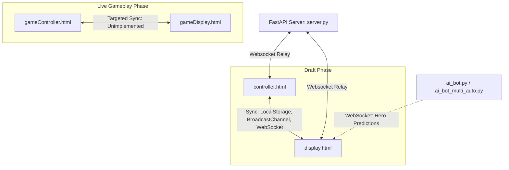

# Draft Overlay Functionality Audit & Specifications

This document lists all interactive elements (buttons, inputs, uploads) in [controller.html](file:///Users/klydu/PersonalProjects/mlbb-stream-overlays/controller.html), details their status, identifies bugs, and outlines missing functions that require development.

---

## 1. System Architecture & Partner Relationships

The project is structured around two main panels, with two additional placeholders designed to handle live gameplay overlays:



### File Partnerships:
*   **[controller.html](file:///Users/klydu/PersonalProjects/mlbb-stream-overlays/controller.html) & [display.html](file:///Users/klydu/PersonalProjects/mlbb-stream-overlays/display.html):** 
    *   **Purpose:** Partnered to manage the Hero Draft phase.
    *   **Interaction:** The administrator interacts with the control panel (`controller.html`) to input team names, draft picks, bans, scores, and camera URLs. The stream overlay (`display.html`) displays this data in real-time with visual effects, animations, and character voicelines.
*   **[gameController.html](file:///Users/klydu/PersonalProjects/mlbb-stream-overlays/gameController.html) & [gameDisplay.html](file:///Users/klydu/PersonalProjects/mlbb-stream-overlays/gameDisplay.html) (or display.html):**
    *   **Purpose:** Partnered to manage the Live Gameplay overlays (e.g., scoreboards, gold differences, match stats).
    *   **Status:** Currently empty shell files containing only boilerplate HTML. `gameController.html` has a single empty `<button></button>` element, and `gameDisplay.html` has an empty body.

---

## 2. Interactive Elements Audit Table

Below is an audit of every button and input element defined in [controller.html](file:///Users/klydu/PersonalProjects/mlbb-stream-overlays/controller.html):

| Section             | Element in HTML             | ID / Selector           | JS File Bound                          | Current Status　　　 | Issues / Bugs Identified                                                                                                                                                |
| :--------------------| :----------------------------| :------------------------| :---------------------------------------| :---------------------| :------------------------------------------------------------------------------------------------------------------------------------------------------------------------|
| **Blue Side desc**  | `ADD SCORE` Button          | *None*                  | *None*                                 | 🔴 **Unimplemented** | Click does nothing. No ID, class, or event listener is bound.                                                                                                           |
| **Blue Side desc**  | `DEDUCT SCORE` Button       | *None*                  | *None*                                 | 🔴 **Unimplemented** | Click does nothing. No ID, class, or event listener is bound.                                                                                                           |
| **Blue Side desc**  | `Upload Logo` Input         | `.team-logo-upload`     | `js/showLogo.js`                       | 🔴 **Broken**　　　　| `js/showLogo.js` is completely empty. Uploading a file does nothing.                                                                                                    |
| **Blue Side desc**  | `CAMERA LINK` Input         | `#team-cam-link-1`      | `js/control.js`                        | 🟡 **Partial**　　　　| Saves to `localStorage` on input, but does not broadcast or sync.                                                                                                       |
| **Blue Side cams**  | `CAMERA LINK` Inputs (1-5)  | `#cam-1` to `#cam-5`    | `js/control.js`                        | 🟡 **Partial**　　　　| Saves to `localStorage` on input, but does not broadcast or sync.                                                                                                       |
| **Blue Side names** | Player Names (1-5)          | `#input-name-1` to `5`  | `js/control.js`                        | 🟢 **Working**　　　　| Updates display in real-time via `BroadcastChannel` and WebSocket.                                                                                                      |
| **Blue Side picks** | Hero Pick Inputs (1-5)      | `#pick-1` to `#pick-5`  | `js/control.js` / `js/autocomplete.js` | 🟢 **Working**　　　　| Integrates with autocomplete, updates local storage and websocket on selection.                                                                                         |
| **Blue Side swap**  | `swap` Buttons (1-5)        | `#swap-1` to `#swap-5`  | `js/swap.js`                           | 🟡 **Buggy**　　　　　| Swaps inputs locally and in `localStorage`, but **does not broadcast** updates to the display overlay via WS/BroadcastChannel.                                          |
| **Blue Side bans**  | Ban Inputs (1-5)            | `#ban-1` to `#ban-5`    | `js/control.js` / `js/autocomplete.js` | 🟢 **Working**　　　　| Integrates with autocomplete, updates display via WebSocket.                                                                                                            |
| **Red Side desc**   | `ADD SCORE` Button          | *None*                  | *None*                                 | 🔴 **Unimplemented** | Click does nothing. No ID, class, or event listener is bound.                                                                                                           |
| **Red Side desc**   | `DEDUCT SCORE` Button       | *None*                  | *None*                                 | 🔴 **Unimplemented** | Click does nothing. No ID, class, or event listener is bound.                                                                                                           |
| **Red Side desc**   | `Upload Logo` Input         | `.team-logo-upload`     | `js/showLogo.js`                       | 🔴 **Broken**　　　　| `js/showLogo.js` is completely empty. Uploading a file does nothing.                                                                                                    |
| **Red Side desc**   | `CAMERA LINK` Input         | `#team-cam-link-2`      | `js/control.js`                        | 🟡 **Partial**　　　　| Saves to `localStorage` on input, but does not broadcast or sync.                                                                                                       |
| **Red Side cams**   | `CAMERA LINK` Inputs (6-10) | `#cam-6` to `#cam-10`   | `js/control.js`                        | 🟡 **Partial**　　　　| Saves to `localStorage` on input, but does not broadcast or sync.                                                                                                       |
| **Red Side names**  | Player Names (6-10)         | `#input-name-6` to `10` | `js/control.js`                        | 🟢 **Working**　　　　| Updates display in real-time via `BroadcastChannel` and WebSocket.                                                                                                      |
| **Red Side picks**  | Hero Pick Inputs (6-10)     | `#pick-6` to `#pick-10` | `js/control.js` / `js/autocomplete.js` | 🟢 **Working**　　　　| Integrates with autocomplete, updates display via WebSocket.                                                                                                            |
| **Red Side swap**   | `swap` Buttons (6-10)       | `#swap-6` to `#swap-10` | `js/swap.js`                           | 🟡 **Buggy**　　　　　| Swaps inputs locally and in `localStorage`, but **does not broadcast** updates to the display overlay via WS/BroadcastChannel.                                          |
| **Red Side bans**   | Ban Inputs (6-10)           | `#ban-6` to `#ban-10`   | `js/control.js` / `js/autocomplete.js` | 🟢 **Working**　　　　| Integrates with autocomplete, updates display via WebSocket.                                                                                                            |
| **Draft Control**   | `RESET DRAFT` Button        | `#reset`                | `js/control.js`                        | 🟢 **Working**　　　　| Clears inputs, local storage, and sends reset command via BroadcastChannel & WebSocket.                                                                                 |
| **Draft Control**   | `SWITCH TEAMS` Button       | `#switch`               | `js/control.js`                        | 🟢 **Working**　　　　| Swaps all inputs, team names, logos, camera links, picks, and bans, writes them to localStorage, and syncs across BroadcastChannel and WebSocket.                       |
| **Draft Control**   | `SHOW DISPLAY` Button       | `#show-display-button`  | `js/obsWebsocket/showDisplay.js`       | 🟢 **Working**　　　　| Creates a browser source in OBS using WebSocket connection.                                                                                                             |
| **Team Control**    | `CLEAR NAMES` Button        | `#clear-names`          | `js/clear.js`                          | 🟢 **Working**　　　　| Clears names locally, via `BroadcastChannel`, and via WebSocket for remote displays.                                                                                    |
| **Team Control**    | `CLEAR PICKS` Button        | `#clear-picks`          | `js/clear.js`                          | 🟢 **Working**　　　　| Clears picks locally, via `BroadcastChannel`, and via WebSocket for remote displays.                                                                                    |
| **Team Control**    | `CLEAR BANS` Button         | `#clear-bans`           | `js/clear.js`                          | 🟢 **Working**　　　　| Clears bans locally, via `BroadcastChannel`, and via WebSocket for remote displays.                                                                                     |
| **Team Control**    | `CLEAR SCORES` Button       | `#clear-scores`         | `js/clear.js`                          | 🟢 **Working**　　　　| Clears scores from localStorage and syncs via `BroadcastChannel` and WebSocket.                                                                                         |
| **Team Control**    | `CLEAR LOGO` Button         | `#clear-logos`          | `js/showLogo.js`                       | 🟢 **Working**　　　　| Clears logos from localStorage and syncs via `BroadcastChannel` and WebSocket.                                                                                          |
| **Team Control**    | `CLEAR CAM LINK` Button     | `#clear-cam-links`      | `js/clear.js`                          | 🟢 **Working**　　　　| Clears individual cam links (`#cam-1` to `10`) and team cam links, syncs via `BroadcastChannel` and WebSocket.                                                          |
| **Match Info**      | `GAME NUMBER` Input         | `#gameNumberInput`      | `js/control.js` / `js/display.js` | 🟢 **Working**　　　　| Listens for input, saves to `localStorage`, and syncs via `BroadcastChannel` and WebSocket.                                                             |
| **Match Info**      | `MATCH NUMBER` Input        | `#matchNumberInput`     | `js/control.js` / `js/display.js` | 🟢 **Working**　　　　| Listens for input, saves to `localStorage`, and syncs via `BroadcastChannel` and WebSocket.                                                             |
| **Match Info**      | `Select Match` Dropdown     | `#customMenu`           | `js/control.js` / `js/display.js` | 🟢 **Working**　　　　| Saves round name to `localStorage`, broadcasts via `BroadcastChannel` and WebSocket, and initializes correctly on display load.                         |
| **Timer Control**   | `START` Button              | `#startBtn`             | `js/timer.js`                          | 🟢 **Working**　　　　| Starts timer, transitions phase, updates state locally.                                                                                                                 |
| **Timer Control**   | `RESET` Button              | `#resetPhase`           | `js/timer.js`                          | 🟢 **Working**　　　　| Resets phase to 0, stops timer.                                                                                                                                         |
| **Timer Control**   | `NEXT PHASE` Button         | `#nextPhaseBtn`         | `js/timer.js`                          | 🟢 **Working**　　　　| Advances phase, auto-starts timer, alerts upon draft completion.                                                                                                        |

---

## 3. Detailed Bugs & Sync Inconsistencies

### A. The Remote Display Sync Gap (Critical WebSocket Inconsistencies)
The display page ([display.html](file:///Users/klydu/PersonalProjects/mlbb-stream-overlays/display.html)) is synchronized with the controller via three mechanisms: `localStorage` updates, `BroadcastChannel` messages, and `WebSocket` messages. However, these are implemented inconsistently:
*   **Local-Only Events:** The `storage` window listener only fires for tabs open on the *same machine in the same browser*. Similarly, `BroadcastChannel` is strictly same-origin.
*   **Remote Breakdown:** If the caster/overlay runs on a separate machine (using the `FastAPI` server at `ws://localhost:8080/ws`), several actions will **fail to synchronize** because they do not send WebSocket messages:
    1.  **Hero Swaps (`js/swap.js`):** Swaps only modify the controller inputs and `localStorage`. The remote overlay will never receive the swap message.
    2.  **Clear Operations (`js/clear.js`):** "Clear Names", "Clear Picks", and "Clear Bans" only broadcast via `BroadcastChannel`. They do not transmit WebSocket commands.
    3.  **Match Info Dropdown:** Selecting "GRAND FINALS", "SEMI FINAL", or "PLAYOFFS" only sets a `localStorage` item and does not broadcast.

### B. Team Switch Reversion Bug
In [js/control.js](file:///Users/klydu/PersonalProjects/mlbb-stream-overlays/js/control.js) (lines 33-114), clicking "SWITCH TEAMS" swaps the player name input values:
```javascript
if (nameBlue && nameRed) {
  nameBlue.value = names[`input-name-${i + 5}`];
  nameRed.value = names[`input-name-${i}`];
}
```
However, it **never calls `localStorage.setItem` for these new names** (unlike hero picks which are written back to storage on lines 64 and 66). If the caster refreshes the controller page after switching teams, the player names will revert to their pre-switch configurations.

### C. Display Round Name Initialization Miss
On page load in [js/display.js](file:///Users/klydu/PersonalProjects/mlbb-stream-overlays/js/display.js), there are DOMContentLoaded listeners to restore saved team names and player names:
```javascript
window.addEventListener('DOMContentLoaded', initializeHeroNames);
window.addEventListener('DOMContentLoaded', initializeSavedTeamNames);
window.addEventListener('DOMContentLoaded', initializeNames);
```
There is no initializer for `round-name`. As a result, the match phase text (e.g., `PLAYOFFS`) will reset to the default HTML placeholder value on reload, even if a custom value was previously selected and saved in storage.

---

## 4. Missing Functions That Need Work

### A. Team Score Counters (Add/Deduct/Clear)
*   **Requirement:** The score buttons on the Blue and Red sides need to increment or decrement the team scores.
*   **Integration:** 
    *   Add event listeners to the score buttons in `controller.html` (which need IDs or classes).
    *   Track the scores in `localStorage` (e.g., `blue-score`, `red-score`).
    *   Broadcast changes via WebSocket and `BroadcastChannel`.
    *   In `display.html`, target the `.blue-score` and `.red-score` wrappers. Currently, they contain three empty `.score` divs. The overlay should light up/fill the appropriate number of score indicator blocks based on the score (e.g., for Best-of-3, filling up to 2 blocks).
    *   Connect the `CLEAR SCORES` button in the controller to reset scores to `0` and sync this with the display overlay.

### B. Team Logo Uploader
*   **Requirement:** Casters must be able to upload team logos dynamically.
*   **Integration:**
    *   Implement file load handlers in `js/showLogo.js`.
    *   Convert uploaded images to Base64 Data URLs using a `FileReader`.
    *   Store the Base64 URLs in `localStorage` (`blue-logo-raw`, `red-logo-raw`).
    *   Transmit the base64 logo data over WebSockets / `BroadcastChannel` to update the display overlay in real-time.
    *   In `js/display.js`, display the base64 images in `#team-logo-1` through `#team-logo-4`.
    *   Connect the `CLEAR LOGO` button in the controller to delete the stored images, revert to default logos, and sync the reset state.

### C. Live Match Info Inputs (Game & Match Numbers)
*   **Requirement:** The overlay needs to show the correct Game and Match number.
*   **Integration:**
    *   Add `input` event listeners to `#gameNumberInput` and `#matchNumberInput` in `js/control.js`.
    *   Save values to `localStorage` (e.g., `game-number`, `match-number`).
    *   Send changes via WebSockets and `BroadcastChannel`.
    *   In `js/display.js`, handle these events and update `#gameNumber` and `#matchNumber` elements.
    *   Ensure they populate correctly on display reload.

### D. Game Controller & In-Game Display overlays
*   **Requirement:** Live gameplay overlay control (Partnering `gameController.html` with `gameDisplay.html`).
*   **Integration:**
    *   Develop buttons/forms in `gameController.html` to toggle scoreboard displays, gold comparison charts, player build sheets, and MVP banners.
    *   Develop WebSocket relays or local storage listeners in `gameDisplay.html` to show/hide these overlays dynamically during match live broadcast.
